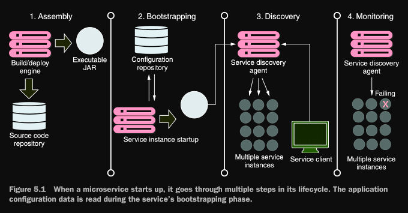
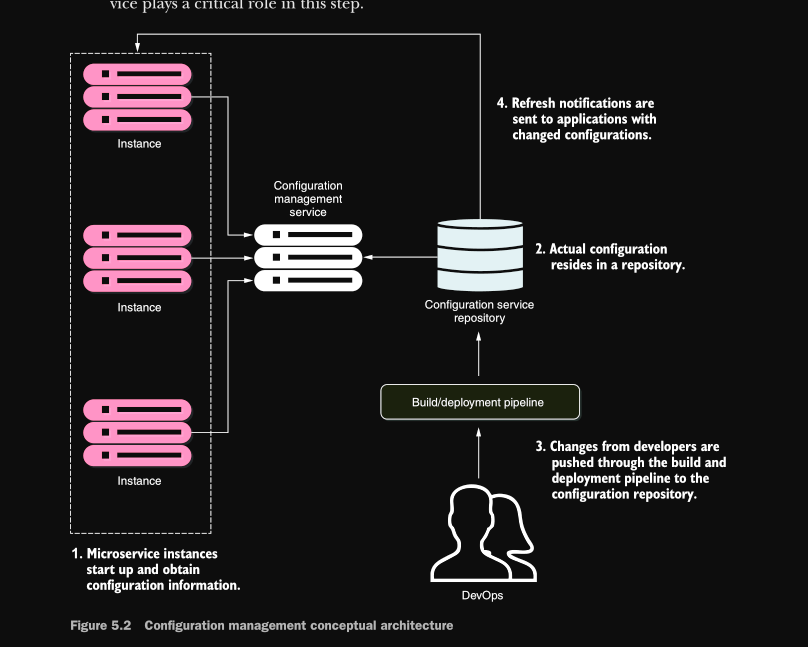
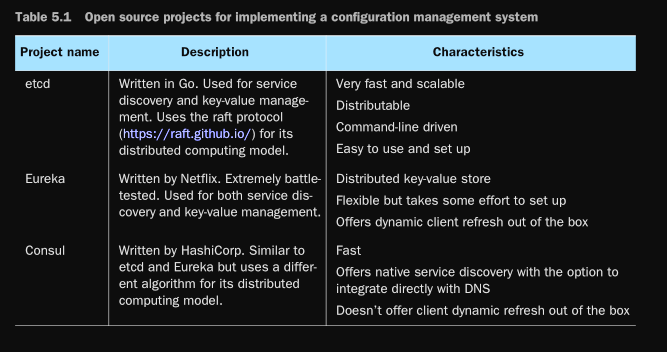
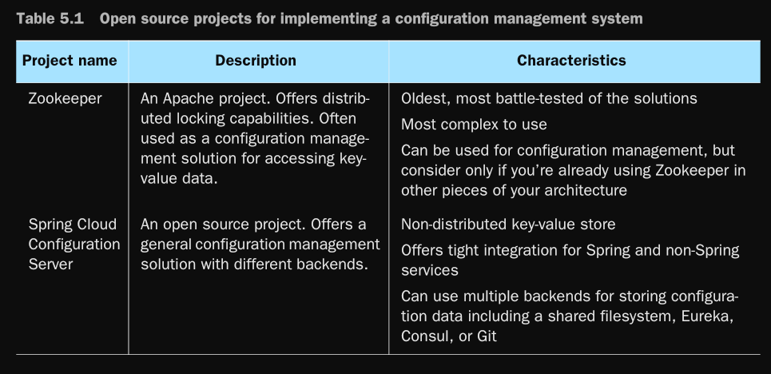

# configuration management
### Spring Cloud Configuration Server

> la carga de la gestión de configuration management  para un microservicio se
produce durante la fase de arranque del microservicio.
la figura  muestra el ciclo de vida del microservicio.
>
> 
>
> la gestión de configuración de aplicaciones estableciendo
cuatro principios que queremos seguir:
> *  Segregate—Necesitamos separar completamente la información de configuración del servicio
     del despliegue físico real de un servicio. De hecho, la aplicación
     la figuración no debe implementarse con la instancia de servicio. En cambio,
     la información de configuración debe pasarse como variables de entorno al servicio de inicio o leer desde un repositorio centralizado cuando se inicia el servicio.
> *  Abstract—También necesitamos abstraer el acceso a los datos de configuración detrás de un servicio
     interfaz. En lugar de escribir código que lea directamente el repositorio de servicios,
     ya sea una base de datos basada en archivos o JDBC, deberíamos usar un servidor JSON basado en REST.
     vice para recuperar los datos de configuración de la aplicación.
> *  Centralize—porque una aplicación basada en la nube puede tener literalmente cientos de
     servicios, es fundamental minimizar la cantidad de repositorios diferentes utilizados para
     mantener los datos de configuración. Centralice la configuración de su aplicación en tan pocos
     repositorios como sea posible.
> *   Harden—Porque la información de configuración de su aplicación va a ser
      completamente segregado de su servicio implementado y centralizado, es fundamental
      que la solución que utilice e implemente sea altamente disponible y redundante.
>
> Una de las cosas clave que debe recordar es que cuando separa su configuración
información fuera de su código real, está creando una dependencia externa que
será necesario administrar y controlar la versión. No podemos enfatizar lo suficiente que el
es necesario realizar un seguimiento de los datos de configuración de la aplicación y controlar la versión porque
configuración de aplicaciones mal administrada es un caldo de cultivo fértil para
detectar errores e interrupciones no planificadas.
>
>
> Tomemos los cuatro principios y vea cómo se aplican cuando se inicia el servicio.
la figura presenta el proceso de arranque con más detalle y muestra cómo un servicio de configuración
juega un papel fundamental en este paso.
>
> 
>
> 1 Cuando aparece una instancia de microservicio, llama a un punto final de servicio para leer su
información de configuración, que es específica para el entorno en el que está operando
in. La información de conexión para la gestión de configuración (conexión
credenciales de ción, punto final de servicio, etc.) luego pasa al microservicio
como empieza.
>
> 2 La configuración real reside en un repositorio. Basado en la implementación
de su repositorio de configuración, puede elegir diferentes formas de mantener su
datos de configuración Esto puede incluir archivos bajo control de fuente, datos relacionales.
bases o almacenes de datos clave-valor.
>
> 3 La gestión real de los datos de configuración de la aplicación se produce de forma independiente.
dependiendo de cómo se implemente la aplicación. Cambios en el manual de configuración
La administración generalmente se maneja a través de la canalización de compilación e implementación,
donde las modificaciones se pueden etiquetar con información de versión e implementar
a través de los diferentes entornos (desarrollo, puesta en escena, producción y
etcétera).
>
> 4 Cuando cambia la gestión de la configuración, los servicios que utilizan esa aplicación
Los datos de configuración de cationes deben ser notificados de la alteración y actualizar sus
copia de los datos de la solicitud.
>
> # Opciones de implementación
>
> 
> 
>
>
> Todas las soluciones de la tabla se pueden utilizar fácilmente para crear una gestión de configuración
solución. Para los ejemplos de este capítulo y del resto del libro,
utilice Spring Cloud Configuration Server (a menudo llamado Spring Cloud Config
Server o, simplemente, el Config Server), que se adapta perfectamente a nuestro microservicios arquitectura.
Elegimos esta solución porque:
>
> * El servidor de configuración de Spring Cloud es fácil de configurar y usar.
> * Spring Cloud Config se integra estrechamente con Spring Boot. Literalmente puedes leer
    > todos los datos de configuración de su aplicación con algunas anotaciones fáciles de usar.
> * El servidor de configuración ofrece múltiples backends para almacenar datos de configuración.
> * De todas las soluciones de la tabla, Config Server puede integrarse directamente con
    > la plataforma de control de fuente Git y con HashiCorp Vault.
> ### pasos
> 1 Configure un servidor de configuración de Spring Cloud. Demostraremos tres diferentes
mecanismos para servir datos de configuración de aplicaciones, uno que usa el archivo-
system, otro usando un repositorio Git y otro usando HashiCorp Vault.
>
> 2 Continúe creando el servicio de licencias para recuperar datos de una base de datos.
>
> 3 Conecte el servicio Spring Cloud Config a su servicio de licencias para servir
los datos de configuración de la aplicación.
> ## Construyendo nuestro servidor de configuración Spring Cloud
> Spring Cloud Configuration Server es una aplicación basada en REST que se basa en
parte superior de Spring Boot. El servidor de configuración no viene como un servidor independiente. En cambio,
puede elegir incrustarlo en una aplicación Spring Boot existente o iniciar una
nuevo proyecto Spring Boot con el servidor incrustado en él. La mejor práctica es mantener
cosas separadas.
> * el siguiente paso para crear nuestro Spring Cloud Config Server es configurar un archivo más para
    definir la configuración central del servidor para que pueda ejecutarse. Este puede ser uno de los siguientes
    siguiente: application.properties, application.yml, bootstrap.properties o bootstrap.yml.
    El archivo de arranque es un tipo de archivo Spring Cloud específico y se carga antes de la aplicación.
    Archivos cation.properties o application.yml. El archivo de arranque se utiliza para especificar el
    Nombre de la aplicación Spring, la ubicación Git de configuración de Spring Cloud, cifrado/
    información de descifrado, y así sucesivamente. Específicamente, el archivo de arranque es cargado por un par-
    ent Spring ApplicationContext, y ese padre se carga antes que el que usa el
    propiedades de la aplicación o archivos YAML.
    En cuanto a las extensiones de archivo, .yml y .properties son solo formatos de datos diferentes. Tú
    puede elegir el que prefiera. En este libro, verá que usaremos bootstrap.yml
    para definir la configuración del Config Server y los microservicios.
> * El siguiente paso para crear nuestro servicio Spring Cloud Config es configurar Spring
    Clase de arranque de Cloud Config. Cada servicio de Spring Cloud necesita una clase de arranque que
    podemos usar para lanzar el servicio
> 
> * ## Usando Spring Cloud Config Server en filesystem
> El servidor de configuración de Spring Cloud utiliza una entrada en el archivo appication.yml para
apunte al repositorio que contiene los datos de configuración de la aplicación. configurar un
El repositorio basado en el si

```
cloud:
    config:
        server:
            bootstrap: true
            composite:
                - type: native
                search-locations: classpath:/config
```